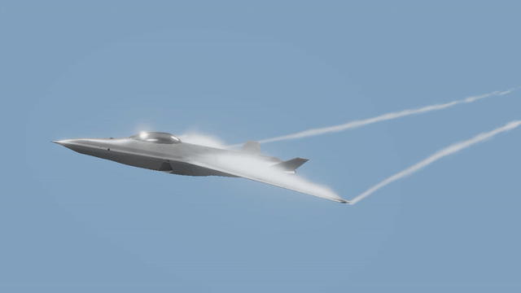
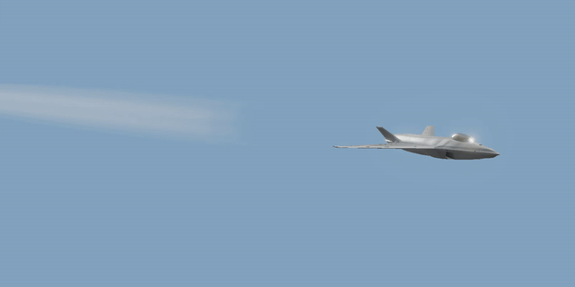

# aeronautic

[](https://github.com/Romainlg29/aeronautic/actions/workflows/ci.yml)
[](LICENSE)

Physically based **aircraft effects** for **three.js** and **React Three
Fiber**, raymarched in TSL for WebGPU. Describe the engine, the airframe and
the day: the look comes out of them.

**[Docs and live examples](https://romainlg29.github.io/aeronautic/)**

| Package                                                  | npm                                                                                                                   | What it draws                                                        |
| -------------------------------------------------------- | --------------------------------------------------------------------------------------------------------------------- | -------------------------------------------------------------------- |
| [`@aeronautic/afterburner`](packages/afterburner#readme) | [](https://www.npmjs.com/package/@aeronautic/afterburner) | Jet afterburners and rocket exhaust plumes                           |
| [`@aeronautic/wing-vapor`](packages/wing-vapor#readme)   | [](https://www.npmjs.com/package/@aeronautic/wing-vapor)   | Vortex trails, shock vapor and the vapor cone a wing pulls in air    |
| [`@aeronautic/contrails`](packages/contrails#readme)     | [](https://www.npmjs.com/package/@aeronautic/contrails)     | Engine contrails that form, sink, spread and persist as the day says |
| [`@aeronautic/lights`](packages/lights#readme)           | [](https://www.npmjs.com/package/@aeronautic/lights)           | Navigation, anti-collision, landing and taxi lights, to the rule     |
| [`@aeronautic/controls`](packages/controls#readme)       | [](https://www.npmjs.com/package/@aeronautic/controls)       | Control surfaces, gear, nozzles and thrust vectoring on a model      |
| [`@aeronautic/core`](packages/core#readme)               | [](https://www.npmjs.com/package/@aeronautic/core)               | The shared flight, the atmosphere and the depth capture              |

Each installs on its own, with the same peers: `@aeronautic/core`, `three`
0.186, plus `react` 19 and `@react-three/fiber` 9 (or 10) for the components
in each package's `/react` entry. The package roots are plain three.js, with no
React. Each release supports one three minor, because TSL changes between
them. The effects need three's `WebGPURenderer`, which falls back to WebGL 2 by
itself; in R3F, `gl={webgpu_gl()}` from `@aeronautic/core/react` makes one.
They don't run on the classic `WebGLRenderer`.

## Afterburner


Realistic **jet engine afterburner** and **rocket exhaust plumes**, with
shock diamonds (Mach diamonds), heat haze, soot and eddies. Every plume in a
batch is one instanced draw.

```bash
pnpm add @aeronautic/afterburner @aeronautic/core three@~0.186 @react-three/fiber
```

`<Afterburner>` is a group where a nozzle sits. The plume streams out along the
group's local **+Z**, aft of a model that flies along -Z, and every distance is in metres:

```tsx
import { Canvas } from "@react-three/fiber";
import { Afterburner } from "@aeronautic/afterburner/react";
import { webgpu_gl } from "@aeronautic/core/react";

export const App = () => (
  <Canvas gl={webgpu_gl()}>
    <Afterburner preset="afterburner" params={{ nozzleRadiusM: 0.5 }} />
  </Canvas>
);
```

Seven presets, from a fighter's reheat to a methalox booster, and physical
params in SI units: the plume's length and its shock spacing come out of them.
Sit it on any node of a loaded model with `target`, shape the exit, and drive
the throttle every frame through a ref.

[Afterburner docs](https://romainlg29.github.io/aeronautic/docs/afterburner/start/introduction/)
· [README](packages/afterburner/README.md)
· [How the plume works](https://romainlg29.github.io/aeronautic/docs/afterburner/how-it-works/the-plume/)

## Wing vapor



The vapor a wing pulls out of humid air: **tip vortex trails** that follow the
flight path, **leading-edge vortices** over a swept wing, **shock vapor** over
the wing and the **vapor cone** near Mach one. Nothing is drawn to a shape: it
works out the pressure round the aircraft from its planform, its airspeed and
its angle of attack, and expands the day's moist air through it.

```bash
pnpm add @aeronautic/wing-vapor @aeronautic/core three@~0.186 @react-three/fiber
```

Put `<WingVapor>` at the aircraft's reference point. It can measure the
planform off the model itself:

```tsx
import { useGLTF } from "@react-three/drei";
import { WingVapor } from "@aeronautic/wing-vapor/react";

export const Jet = () => {
  const { scene } = useGLTF("/jet.glb");

  return (
    <group>
      <primitive object={scene} />
      <WingVapor
        capture={scene}
        flight={{ airspeedMPerS: 170, angleOfAttackRad: 0.35 }}
        air={{ altitudeM: 300, relativeHumidity: 0.9 }}
      />
    </group>
  );
};
```

[Wing vapor docs](https://romainlg29.github.io/aeronautic/docs/wing-vapor/start/introduction/)
· [README](packages/wing-vapor/README.md)
· [How the vapor forms](https://romainlg29.github.io/aeronautic/docs/wing-vapor/how-it-works/the-air/)

## Contrails



The **condensation trails** an aircraft's engines leave at altitude. Each
forms where its exhaust has cooled past water saturation, freezes, is drawn
round the wake's vortices and sunk with them, and spreads as it mixes. Whether
it forms is the **Schmidt–Appleman criterion** for the day and the engines;
whether it lasts is the air's **humidity over ice**.

```bash
pnpm add @aeronautic/contrails @aeronautic/core three@~0.186 @react-three/fiber
```

Put `<Contrails>` at the aircraft's reference point, with its engines:

```tsx
import { Contrails } from "@aeronautic/contrails/react";

export const Jet = () => (
  <group>
    <JetModel />
    <Contrails
      airframe={{
        massKg: 20_000,
        spanM: 14,
        engines: [
          [-0.75, 0.05, 7],
          [0.75, 0.05, 7],
        ],
      }}
      flight={{ airspeedMPerS: 250 }}
      air={{ altitudeM: 11_000, relativeHumidity: 0.66 }}
    />
  </group>
);
```

[Contrails docs](https://romainlg29.github.io/aeronautic/docs/contrails/start/introduction/)
· [README](packages/contrails/README.md)
· [How they form](https://romainlg29.github.io/aeronautic/docs/contrails/how-it-works/forming/)

## Lights

The **lights** the airworthiness rules give an aircraft, as the eye sees them
at night and at range. The navigation lights over their arcs and with their
intensities (**CS/FAR 25.1385–1397**), the anti-collision lights flashing at
their **Blondel–Rey** effective intensity, the landing and taxi beams lighting
the ground and showing in the air, and the **glare** the eye spreads round
each, dimmed and reddened by the day's haze.

```bash
pnpm add @aeronautic/lights @aeronautic/core three@~0.186 @react-three/fiber
```

Put `<Lights>` at the aircraft's reference point, with its lights:

```tsx
import { Lights } from "@aeronautic/lights/react";

export const Jet = () => (
  <group>
    <JetModel />
    <Lights
      airframe={{
        navigation: [
          { side: "left", at: [-6.8, -0.27, 4.46] },
          { side: "right", at: [6.8, -0.27, 4.46] },
          { side: "aft", at: [0, 0.03, 6.71] },
        ],
        anticollision: [{ at: [0, 0.47, 3.7], color: "white" }],
        beams: [{ at: [0, -1.3, -6.2], lamp: "taxi" }],
      }}
      air={{ visibilityM: 4000 }}
    />
  </group>
);
```

[Lights docs](https://romainlg29.github.io/aeronautic/docs/lights/start/introduction/)
· [README](packages/lights/README.md)
· [How it works](https://romainlg29.github.io/aeronautic/docs/lights/how-it-works/the-rule/)

## The repository

- [`packages/afterburner`](packages/afterburner): `@aeronautic/afterburner`.
- [`packages/wing-vapor`](packages/wing-vapor): `@aeronautic/wing-vapor`.
- [`packages/contrails`](packages/contrails): `@aeronautic/contrails`.
- [`packages/lights`](packages/lights): `@aeronautic/lights`.
- [`packages/controls`](packages/controls): `@aeronautic/controls`.
- [`packages/core`](packages/core): `@aeronautic/core`, which the others
  depend on.
- [`apps/docs`](apps/docs): a [Fumadocs](https://fumadocs.dev) site (Next.js,
  exported static) with a section per library: getting started, guides, live
  examples, the reference and how the shaders work. Deployed to GitHub Pages at
  <https://romainlg29.github.io/aeronautic/>.

## Development

```bash
pnpm install
pnpm dev             # the docs and live examples, on http://localhost:3000
pnpm dev:docs        # the same
pnpm test            # vitest
pnpm lint            # oxlint
pnpm fmt             # oxfmt (fmt:check in CI)
pnpm typecheck
pnpm build           # the libraries, with tsdown (Rolldown)
pnpm build:docs      # the docs, into apps/docs/out
```

There's no `pnpm docs` script, because that name is pnpm's own command (it
opens a package's homepage) and would win over the script.

The docs' params, profile and quality pages are generated from the comments in
`packages/afterburner/src/types.ts` by `apps/docs/scripts/reference.ts`, before
every docs build and dev server. Edit the comments, not the pages.

Each live example is a file in `apps/docs/examples/`. Its page runs that file
and shows it as the code, so the two cannot drift.

The fighter in the docs' "On a model" example is
`apps/docs/public/fighter.glb`. It is the Blender export with its meshes
compressed with meshopt and its textures capped at 2048² WebP (2.4 MB, from 6.8),
every node name kept: the plumes sit on its `FX_Exhaust_L` and `FX_Exhaust_R`
empties. drei's `useGLTF` decodes meshopt by itself.

The docs build reads `BASE_PATH` (default `/`) and `REPOSITORY_URL`, which the
Pages workflow sets.

## How it was made

These libraries were written with AI, under human supervision throughout. The AI
wrote much of the code. A human set the direction, reviewed every change,
checked each result in the browser and decided what shipped. The physics, the
look and the API were argued over and reworked until they were right, not
accepted as they first came out.

Performance was the main objective from the start:

- Every plume in a batch is one instanced draw.
- The raymarch runs inside a tight proxy hull, so pixels outside it are never
  shaded.
- Distance tiers cut the steps for plumes far from the camera.
- An optional half-resolution pass covers scenes with many nozzles.

Each of these was measured in GPU time, not FPS, from the worst-case viewpoint
(close up, astern) as well as the common one (abeam).
[Frame budget](https://romainlg29.github.io/aeronautic/docs/afterburner/how-it-works/frame-budget/)
in the docs shows where the time goes.

## Contributing

Bug reports, new presets, performance work and AI-assisted PRs are all
welcome. See [CONTRIBUTING.md](CONTRIBUTING.md) for setup, the checks, how to
add a preset and how to measure performance. Report security issues privately,
as [SECURITY.md](SECURITY.md) describes.

The docs deploy on every push to `main`. Releases to npm are
the maintainer's, each package from a tag naming it, `core-v*`, `afterburner-v*`,
`wing-vapor-v*`, `contrails-v*`, `lights-v*` or `controls-v*` (see [RELEASING.md](RELEASING.md)).

What's planned next is in [ROADMAP.md](ROADMAP.md).

## License

[MIT](LICENSE) © Romain Le Gall
