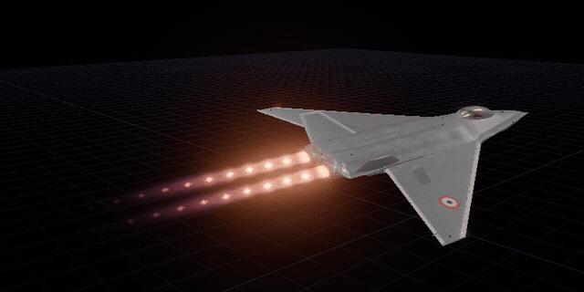

# r3f-afterburner

[](https://www.npmjs.com/package/r3f-afterburner)
[](https://github.com/Romainlg29/afterburner/actions/workflows/ci.yml)
[](LICENSE)



Realistic **jet engine afterburner** and **rocket exhaust plumes** for
**three.js** and **React Three Fiber**. They are raymarched in TSL for
WebGPU, with shock diamonds (Mach diamonds), heat haze, soot and eddies.
Every plume in a batch is one instanced draw.

**[Docs and live examples](https://romainlg29.github.io/afterburner/)**

- **Library:** [`packages/afterburner`](packages/afterburner), published to npm as
  [`r3f-afterburner`](https://www.npmjs.com/package/r3f-afterburner).
- **Wing vapor:** [`packages/wing-vapor`](packages/wing-vapor), `r3f-wing-vapor`:
  tip and leading-edge vortex trails, shock vapor over the wing and the vapor
  cone, from the aircraft's planform, its flight and the day's humidity. See
  [its README](packages/wing-vapor/README.md).
- **Docs:** [`apps/docs`](apps/docs), a [Fumadocs](https://fumadocs.dev) site
  (Next.js, exported static) with a tutorial, guides, live examples, the
  reference and how the shader works. Deployed to GitHub Pages at
  <https://romainlg29.github.io/afterburner/>.

```bash
pnpm add r3f-afterburner
```

Start with the [docs](https://romainlg29.github.io/afterburner/), or the
[library README](packages/afterburner/README.md) for the full API.

## Usage

Peer dependencies: `react` 19, `three` 0.186 and `@react-three/fiber` 9. Each
release supports one three minor, because TSL changes between them.
The plumes need three's `WebGPURenderer`, which falls back to WebGL 2 by
itself. They don't run on the classic `WebGLRenderer`.

### A first plume

`<Afterburner>` is a group where a nozzle sits. The plume streams out along the
group's local **+X**, and every distance is in metres:

```tsx
import { Canvas } from "@react-three/fiber";
import { Afterburner } from "r3f-afterburner";
import { WebGPURenderer } from "three/webgpu";

export const App = () => (
  <Canvas
    gl={async (props) => {
      const renderer = new WebGPURenderer({ ...props, antialias: false });
      await renderer.init();
      return renderer;
    }}
  >
    <Afterburner preset="afterburner" params={{ nozzle_radius_m: 0.5 }} />
  </Canvas>
);
```

The colours are graded for a filmic tone map (`AgXToneMapping`), and look best
with a little bloom.

### Presets

`afterburner`, `afterburner_turbulent`, `rocket_kerolox`, `rocket_hydrolox`,
`rocket_methalox`, `solid_booster` and `plasma`. A preset is a starting point,
and `params` override it:

```tsx
<Afterburner preset="rocket_kerolox" params={{ nozzle_radius_m: 1.2 }} />
```

The params are physical, in SI units: nozzle radius, exit Mach, exit pressure
ratio, temperature, soot and so on. The plume's length and its shock spacing
come out of them. So a bigger radius gives a bigger rocket, not a stubby one.

### On a model

Pass a node of a loaded model as `target`. `position` and `direction` are then
in that node's frame:

```tsx
const { nodes } = useGLTF("/jet.glb");

<Afterburner
  target={nodes.Engine}
  position={[0, 0, -4.2]} // the nozzle exit
  direction={[0, 0, -1]} // exhaust out of the back
/>;
```

### Shaped nozzles

Exits needn't be round. Set an oval, a flat slot or a rounded rectangle with
four params:

```tsx
<Afterburner
  preset="afterburner"
  params={{
    nozzle_radius_m: 0.27, // the round exit of the same area
    nozzle_aspect: 1.4, // width over height
    nozzle_squareness: 2, // 1 a diamond, 2 an ellipse, 4+ a rounded rectangle
    nozzle_roll: 0, // radians about the plume's axis
    nozzle_outline_length: 1, // how long the shape lasts, in core lengths
  }}
/>
```

For any other outline, use the `outline` hook on `<AfterburnerBatch>`.

### Throttle every frame

A ref takes the throttle without a React render:

```tsx
const engine = useRef<AfterburnerHandle>(null);

useFrame(({ clock }) => {
  if (engine.current)
    engine.current.throttle = 0.95 + 0.15 * Math.sin(clock.elapsedTime);
});

<Afterburner ref={engine} preset="afterburner" />;
```

All the nozzles under one `<AfterburnerBatch>` (or, without one, all those
sharing a preset) are drawn in **one instanced draw call**. The batch also
holds the altitude, the airspeed, the quality setting and the shader hooks.

## Development

```bash
pnpm install
pnpm dev             # the docs and live examples, on http://localhost:3000
pnpm dev:docs        # the same
pnpm test            # vitest
pnpm lint            # oxlint
pnpm fmt             # oxfmt (fmt:check in CI)
pnpm typecheck
pnpm build           # the libraries, with tsdown (Rolldown)
pnpm build:docs      # the docs, into apps/docs/out
```

There's no `pnpm docs` script, because that name is pnpm's own command (it
opens a package's homepage) and would win over the script.

The docs' params, profile and quality pages are generated from the comments in
`packages/afterburner/src/types.ts` by `apps/docs/scripts/reference.ts`, before
every docs build and dev server. Edit the comments, not the pages.

Each live example is a file in `apps/docs/examples/`. Its page runs that file
and shows it as the code, so the two cannot drift.

The fighter in the docs' "On a model" example is
`apps/docs/public/fighter.glb`. It is the Blender export with its meshes
compressed with meshopt and its textures capped at 2048² WebP (2.4 MB, from 6.8),
every node name kept: the plumes sit on its `FX_Exhaust_L` and `FX_Exhaust_R`
empties. drei's `useGLTF` decodes meshopt by itself.

The docs build reads `BASE_PATH` (default `/`) and `REPOSITORY_URL`, which the
Pages workflow sets.

## How it was made

This library was written with AI, under human supervision throughout. The AI
wrote much of the code. A human set the direction, reviewed every change,
checked each result in the browser and decided what shipped. The physics, the
look and the API were argued over and reworked until they were right, not
accepted as they first came out.

Performance was the main objective from the start:

- Every plume in a batch is one instanced draw.
- The raymarch runs inside a tight proxy hull, so pixels outside it are never
  shaded.
- Distance tiers cut the steps for plumes far from the camera.
- An optional half-resolution pass covers scenes with many nozzles.

Each of these was measured in GPU time, not FPS, from the worst-case viewpoint
(close up, astern) as well as the common one (abeam).
[Frame budget](https://romainlg29.github.io/afterburner/docs/how-it-works/frame-budget/)
in the docs shows where the time goes.

## Contributing

Bug reports, new presets, performance work and AI-assisted PRs are all
welcome. See [CONTRIBUTING.md](CONTRIBUTING.md) for setup, the checks, how to
add a preset and how to measure performance. Report security issues privately,
as [SECURITY.md](SECURITY.md) describes.

The docs deploy on every push to `main`. Releases to npm are
the maintainer's, from a `v*` tag (see "Releasing" in CONTRIBUTING.md).

## License

[MIT](LICENSE) © Romain Le Gall
